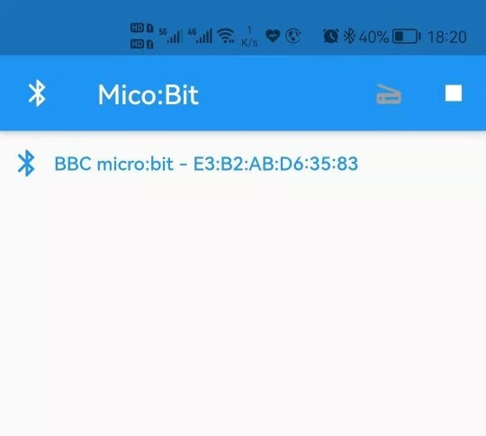
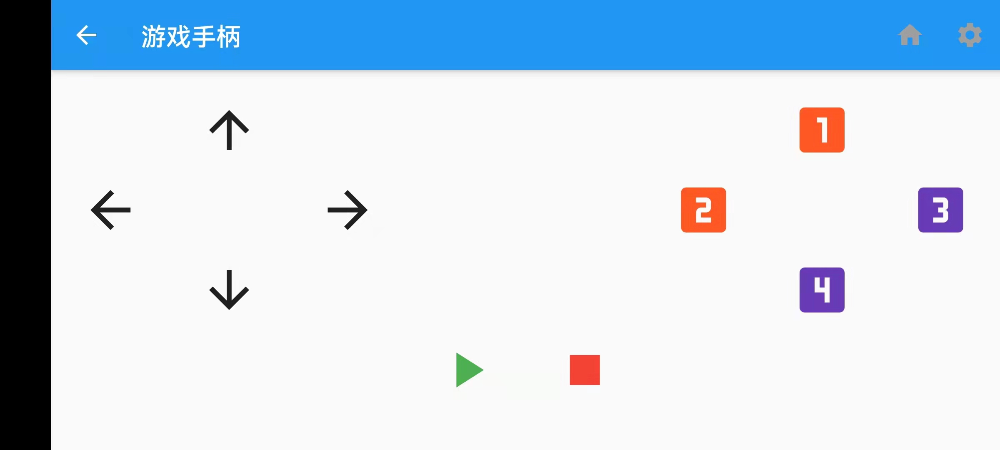
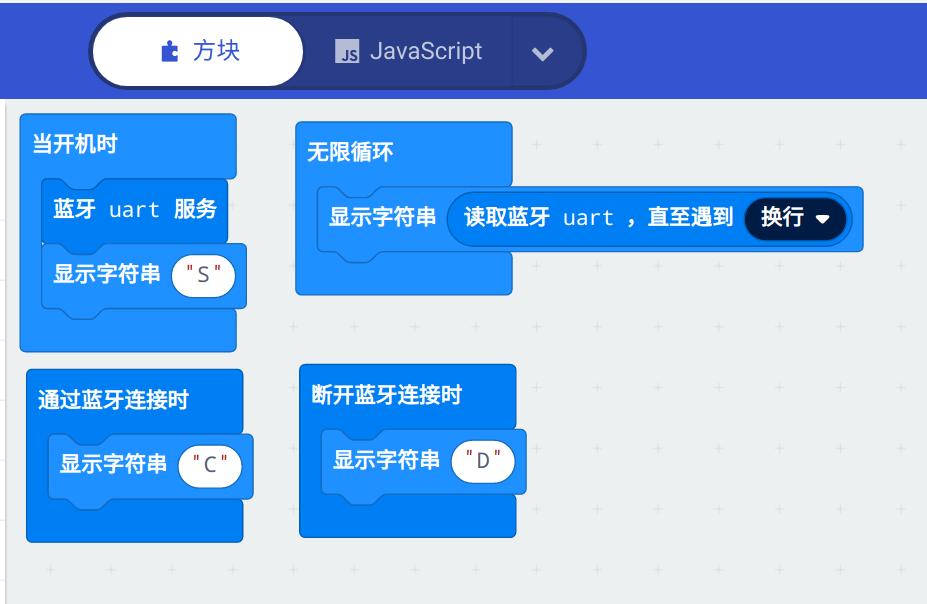

# 简介

通过蓝牙遥控micro:bit的程序。

## 使用方法

### 配对
&nbsp;&nbsp;&nbsp;&nbsp;&nbsp;&nbsp;&nbsp;&nbsp;使用前需要先配对。配对方法：
先在[makecode](https://makecode.microbit.org/)的项目设定中将蓝牙连接方式设置为“JustWorks pairing (default): Pairing is automatic once the pairing is initiated.”。
注意：理论上设置成“No Pairing Required: Anyone can connect via Bluetooth.”就不需要配对，可以任意连接了。但是，实际上并不好用。经常出现找不到蓝牙设备的情况。
- 关机状态配对
    1. 按住A和B按钮不放。
    2. （通电）打开Micro:bit。
    3. 等到Micro:bit上出现蓝牙图案后即可放开A、B按钮。
    4. 在手机蓝牙管理中找到Micro:bit并配对。

- 开机状态配对
    1. 按住A和B按钮不放。
    2. 按一下Micro:bit背后的reset按钮。
    3. 等到Micro:bit上出现蓝牙图案后即可放开A、B按钮。
    4. 在手机蓝牙管理中找到Micro:bit并配对。

### 遥控
&nbsp;&nbsp;&nbsp;&nbsp;&nbsp;&nbsp;&nbsp;&nbsp;打开APP，会自动搜索Micro:bit设备并列出来。

点击搜寻到的Micro:bit设备，即可进入遥控界面。点击按钮中就会发送往Micro:bit发送对应的指令。

具体指令集如下：  

|按钮|指令|备注|
|--|--|--|
|↑|up||
|↓|down||
|←|left||
|→|right||
|1|1||
|2|2||
|3|3||
|4|4||
|▶|start||
|▇|end||

### Micro:bit范例程序
1. 添加蓝牙扩展，位置：【高级】==>【扩展】
   搜索“bluetooth”,点击“bluetooth services”。
   
2. 编写代码
   

   下载地址：[microbit-bluetooth_demo.hex](res/microbit-bluetooth_demo.hex)